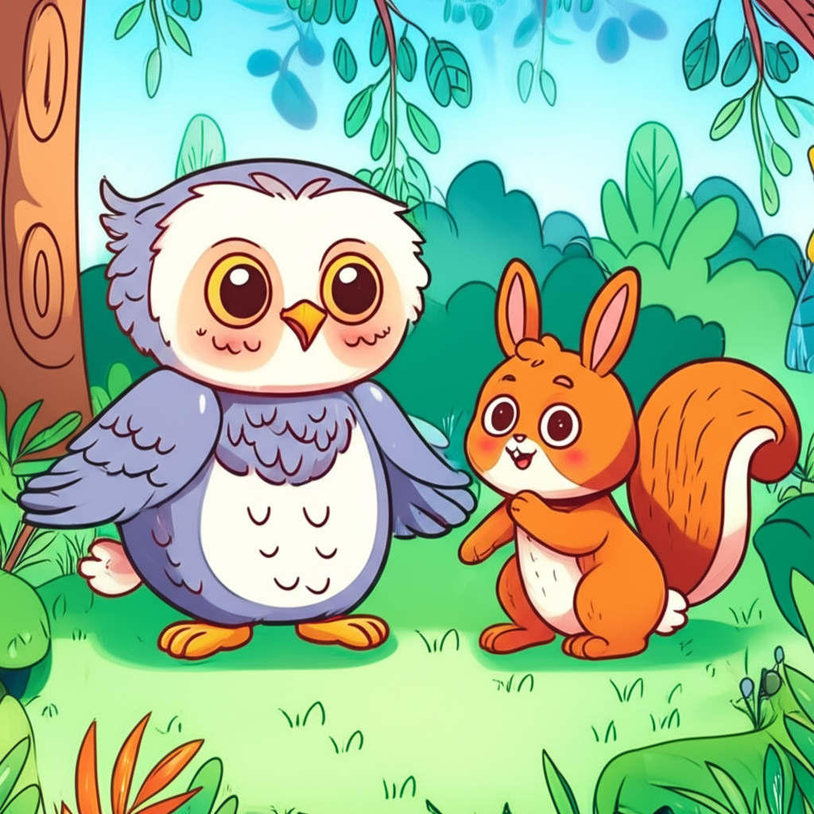

# 有聲童話書

### 動機

這學期學到蠻多關於 LLM 的應用，剛好想趁期末專案嘗試看看不同的應用

而最近 Gemini 2.5 也提供了 TTS 的應用，所以我就想製作一個可以快速提供有趣小故事給小朋友的專案

這個專案要能夠讓小朋友發揮創意，將自己的想法告訴 LLM 後，再由 LLM 幫忙完善一個小故事

最後透過 Gemini 的 image generation 跟 TTS 模型來製作插圖跟語音

讓小朋友不需要自己閱讀就能用聽的去了解這個故事，而且也不需要大人在旁邊輔助

### 使用到的模型與目的

#### 文字模型
模型： `gemini-2.5-pro-preview-05-06` 或 `gemini-2.5-flash-preview-05-20`
輸入： 小朋友對於故事的簡短說明，包含出現的人物和發生的情境
輸出： 將小朋友的想法變為一個 2 ~ 3 分鐘左右的小故事

#### 圖像生成模型
模型： `gemini-2.0-flash-preview-image-generation`
輸入： 包含簡短說明的 prompt
輸出： 一張類似童話故事書中的插畫

#### TTS 模型
模型： `gemini-2.5-flash-preview-tts`
輸入： 每段話的文字 (會將故事切分開來輸入)
輸出： 每段話的語音

### 執行結果

#### 輸入的簡短說明

小兔子Luna迷路了，在森林裡遇到了會說話的貓頭鷹爺爺和小松鼠，他們一起幫助Luna找到回家的路，最後Luna學會了勇敢和相信朋友。

#### 完整故事 (由 LLM 產生)：

親愛的小朋友們，今天，我們要聽一個關於一隻叫做露娜的小兔子，還有她的森林朋友的故事。

[溫暖而輕柔的開場，語速適中，像慈祥的長輩]

在一個陽光普照的早晨，小兔子露娜在森林裡玩耍。露娜有著雪白的毛、短短的尾巴和一雙好奇的紅眼睛。她最喜歡的事情，就是追逐翩翩起舞的蝴蝶，還有採集甜美的漿果。

今天，露娜跑得比平常更遠，追著一隻閃閃發光的藍色蝴蝶。她跑過高大的樹木，越過小溪流，直到蝴蝶消失在樹叢中。當露娜停下來時，她發現周圍的樹木看起來都一樣，熟悉的道路也不見了。她**迷路了**！露娜的眼眶紅紅的，小小的身體開始發抖。她輕聲地抽泣著：「媽媽…爸爸…」

就在這時候，一個溫和又低沉的聲音在她頭頂響起。「小兔子，你怎麼了？」露娜抬起頭，看到一隻有著智慧眼神的大貓頭鷹，正坐在樹枝上。牠的羽毛是漂亮的棕色，眼睛像兩顆閃亮的寶石。

[貓頭鷹爺爺的聲音：緩慢、慈祥、深沉，帶著一點點沙啞]
「我是貓頭鷹爺爺。告訴我，孩子，你為什麼哭泣呢？」

[露娜的聲音：小聲、帶點顫抖、稚嫩]
露娜小聲地說：「貓頭鷹爺爺，我…我迷路了。我找不到回家的路了。」

[小松鼠的聲音：輕快、活潑、語速稍快、音調較高]
「別怕，別怕！」一個輕快又活潑的聲音從樹叢中傳來。一隻小松鼠跳了出來，牠的尾巴蓬鬆又可愛，手裡還抱著一顆小小的橡實。
「我是奇奇！我很會找路喔！貓頭鷹爺爺也超級棒的！」

[貓頭鷹爺爺的聲音：溫和、肯定]
貓頭鷹爺爺點點頭，溫柔地說：「是的，奇奇說得對。我們都會**幫助你**的。」

有了貓頭鷹爺爺和奇奇的陪伴，露娜感覺沒那麼害怕了。貓頭鷹爺爺指著方向，牠說：「家在東邊，那裡有一棵特別高的松樹。」奇奇則在前方跳躍著探路，牠會大聲喊：
[小松鼠的聲音：雀躍]
「這條路是通往小溪的，對嗎，貓頭鷹爺爺？」

[貓頭鷹爺爺的聲音：慈祥]
「沒錯，奇奇，你做得很好。」

露娜則小心翼翼地跟在他們身後，她發現，雖然森林還是很大，但和朋友們在一起，就沒有那麼可怕了。

他們走過一片有點黑黑的樹林，露娜本來有點害怕，但她看到奇奇在前面**勇敢**地跑著，貓頭鷹爺爺也一直鼓勵她。露娜想：「我不能讓朋友失望！」於是，她鼓起勇氣，邁開小短腿，一步一步地跟上。

終於，他們看到了一棵又高又大的松樹，松樹旁邊，就是露娜溫暖的**小家**！露娜開心地尖叫了一聲，一下子衝了過去。

[露娜的聲音：興奮、開心，帶著哭腔]
「媽媽！爸爸！」

兔子媽媽和兔子爸爸衝出來，緊緊地抱住了露娜。

露娜回頭對貓頭鷹爺爺和奇奇說：
[露娜的聲音：真誠、感激，語氣堅定]
「謝謝你們，貓頭鷹爺爺，奇奇！要不是你們，我真不知道該怎麼辦！」

[貓頭鷹爺爺的聲音：慈祥、欣慰]
貓頭鷹爺爺慈祥地說：「露娜，你也很棒，你很**勇敢**，而且學會了**相信朋友**。」

[小松鼠的聲音：雀躍、開心]
奇奇開心地說：「對啊！我們都是**好朋友**！」

從那天以後，露娜不再是那個膽小的小兔子了。她學會了勇敢地面對困難，也明白了，當我們有需要的時候，朋友會永遠在我們身邊。露娜和她的朋友們，在森林裡過著快樂又充實的日子。

[溫暖而輕柔的結尾，語速放緩]
好了，小朋友們，這個關於勇敢和友情的故事就講完了。希望你們也能像露娜一樣，勇敢又樂於助人喔！晚安。

#### 插畫：

#### 語音生成結果：

資料夾 `./speech` 提供 10 個檔案作參考，這部分因為免費 API 的用量很低，可能復現時會中斷
訂閱 Google AI 有辦法增加使用上限，但因為每次生成的故事文字長度會有落差，還是有可能會被中斷